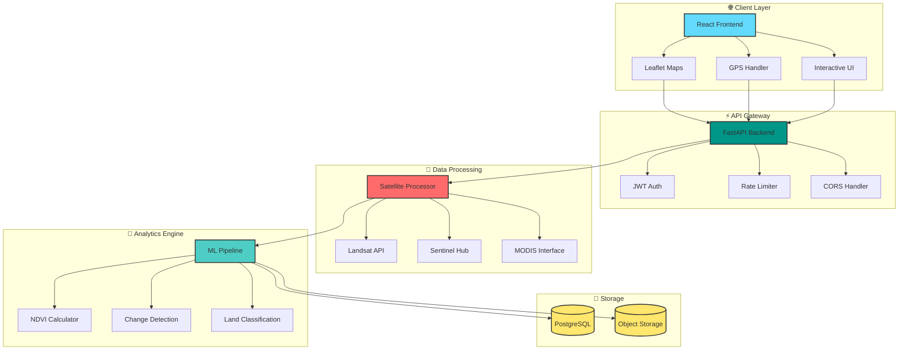

I'll create a beautiful, animated README.md file for SkyWatch Africa with visual appeal and engaging elements.

```markdown
<div align="center">
  
# 🌍 SkyWatch Africa


[](LICENSE)
[](https://python.org)
[](https://reactjs.org)
[](https://fastapi.tiangolo.com)
[](https://postgresql.org)

### 🛰️ **Empowering citizen scientists across Africa to track environmental changes through satellite imagery** 

[✨ Features](#-key-features) • [🏗️ Architecture](#-system-architecture) • [🚀 Quick Start](#-getting-started) • [📚 Docs](#-api-documentation) • [🤝 Contribute](#-contributing)

---


</div>

## 🌟 Overview

<div align="center">
  <table>
    <tr>
      <td align="center">🎯</td>
      <td><b>Africa-Focused</b> - Tailored datasets for African environmental challenges</td>
    </tr>
    <tr>
      <td align="center">🚀</td>
      <td><b>Real-Time Processing</b> - Instant satellite imagery analysis</td>
    </tr>
    <tr>
      <td align="center">🗺️</td>
      <td><b>Interactive Maps</b> - GPS integration & dynamic layers</td>
    </tr>
    <tr>
      <td align="center">📊</td>
      <td><b>Smart Analytics</b> - AI-powered insights from space</td>
    </tr>
  </table>
</div>

<br>

<div align="center">
  
</div>

---

## ✨ Key Features

<div align="center">
  <table>
    <tr>
      <td width="33%" align="center">
        
        <br>
        <b>🛰️ Multi-Source Data</b>
        <br>
        <small>Landsat 8/9 • Sentinel-2 • MODIS</small>
      </td>
      <td width="33%" align="center">
        
        <br>
        <b>🗺️ Interactive Mapping</b>
        <br>
        <small>Real-time GPS • Layer overlays • Export</small>
      </td>
      <td width="33%" align="center">
        
        <br>
        <b>📈 Advanced Analytics</b>
        <br>
        <small>NDVI • Change detection • Trends</small>
      </td>
    </tr>
  </table>
</div>

---

## 🏗️ System Architecture

<div align="center">
  


</div>

---

## 🛠️ Technology Stack

<div align="center">
  
| **Backend** | **Frontend** | **Data Sources** |
|:---:|:---:|:---:|
|  |  | 🛰️ **Landsat 8/9** |
|  |  | 🌍 **Sentinel-2** |
|  |  | 🔭 **MODIS** |
|  |  | 🌐 **Custom APIs** |

</div>

---

## 🚀 Getting Started

<div align="center">
  
### 📋 Prerequisites

```bash
# Check your versions
python --version  # 3.9+
node --version    # 16+
npm --version
git --version
```

</div>

### ⚡ Quick Installation

<details>
<summary><b>🐍 Backend Setup (click to expand)</b></summary>

```bash
# Clone and setup backend
git clone https://github.com/yourusername/skywatch-africa.git
cd skywatch-africa/backend

# Create virtual environment
python -m venv venv
source venv/bin/activate  # Windows: venv\Scripts\activate

# Install dependencies
pip install -r requirements.txt

# Configure environment
cp .env.example .env
# Edit .env with your API keys

# Run migrations
alembic upgrade head

# Start server
uvicorn main:app --reload --port 8000
```

✅ Backend running at `http://localhost:8000`  
📚 API docs at `http://localhost:8000/docs`

</details>

<details>
<summary><b>⚛️ Frontend Setup (click to expand)</b></summary>

```bash
# In a new terminal
cd ../frontend

# Install dependencies
npm install

# Configure environment
cp .env.example .env
# Edit .env with your settings

# Start development server
npm start
```

✅ Frontend running at `http://localhost:3000`

</details>

<details>
<summary><b>🐳 Docker Setup (click to expand)</b></summary>

```bash
# From project root
docker-compose up -d

# View logs
docker-compose logs -f

# Stop services
docker-compose down
```

**Services:**  
- Frontend: http://localhost:3000  
- Backend: http://localhost:8000  
- PostgreSQL: localhost:5432  
- Redis: localhost:6379

</details>

---

## 📖 API Documentation

<div align="center">

### 🔐 Authentication

```bash
curl -X POST http://localhost:8000/api/v1/auth/login \
  -H "Content-Type: application/json" \
  -d '{"api_key": "YOUR_API_KEY"}'
```

### 🗺️ Core Endpoints

| Method | Endpoint | Description |
|--------|----------|-------------|
| `POST` | `/api/v1/satellite/query` | Get satellite imagery |
| `POST` | `/api/v1/analysis/ndvi` | Calculate vegetation index |
| `POST` | `/api/v1/analysis/change-detection` | Detect changes over time |

</div>

<details>
<summary><b>📤 Example Request (click to expand)</b></summary>

```http
POST /api/v1/satellite/query
Authorization: Bearer YOUR_API_KEY
Content-Type: application/json

{
  "coordinates": {
    "lat": -1.2921,
    "lon": 36.8219
  },
  "date_range": {
    "start": "2024-01-01",
    "end": "2024-01-31"
  },
  "sources": ["landsat8", "sentinel2"]
}
```

</details>

---

## 📁 Project Structure

<div align="center">
  
```
📦 skywatch-africa
├── 📂 backend
│   ├── 📂 app
│   │   ├── 📂 api          # API endpoints
│   │   ├── 📂 core         # Config, security
│   │   ├── 📂 models       # DB models
│   │   └── 📂 services     # Business logic
│   ├── 📂 tests            # Unit tests
│   └── 📄 requirements.txt
├── 📂 frontend
│   ├── 📂 src
│   │   ├── 📂 components   # React components
│   │   ├── 📂 hooks        # Custom hooks
│   │   ├── 📂 services     # API services
│   │   └── 📄 App.tsx
│   └── 📄 package.json
├── 📂 docs                 # Documentation
├── 📂 scripts              # Utility scripts
├── 📄 docker-compose.yml
└── 📄 README.md
```

</div>

---

## 🔐 Security Best Practices

<div align="center">

| ✅ | Practice | ✅ | Practice |
|:--:|:--|:--:|:--|
| ✓ | CORS Configuration | ✓ | JWT Authentication |
| ✓ | Input Validation | ✓ | Rate Limiting |
| ✓ | Environment Secrets | ✓ | HTTPS Enforcement |
| ✓ | SQL Injection Prevention | ✓ | Security Audits |

</div>

<details>
<summary><b>🔒 Example: Input Validation</b></summary>

```python
from pydantic import BaseModel, validator

class CoordinateInput(BaseModel):
    lat: float
    lon: float
    
    @validator('lat')
    def validate_latitude(cls, v):
        if not -90 <= v <= 90:
            raise ValueError('Invalid latitude')
        return v
```

</details>

---

## 🐛 Troubleshooting

<div align="center">

| Issue | Solution |
|:------|:---------|
| ❌ Backend won't start | `pip install -r requirements.txt --upgrade` |
| ❌ Database error | Check PostgreSQL is running: `sudo service postgresql status` |
| ❌ Frontend can't connect | Verify `REACT_APP_API_URL` in `.env` |
| ❌ GPS not working | Grant browser location permissions |
| ❌ Map tiles not loading | Check Mapbox token in `.env` |

</div>

---

## 🤝 Contributing

<div align="center">
  
[](https://github.com/yourusername/skywatch-africa/pulls)
[](https://github.com/yourusername/skywatch-africa/graphs/contributors)
[](https://github.com/yourusername/skywatch-africa/issues)

</div>

### 💡 Ways to Contribute

<div align="center">
  
| 🐛 Bug Fixes | ✨ UI Improvements | 🚀 API Features | 📚 Documentation | 🔬 Research |
|:------------:|:------------------:|:----------------:|:-----------------:|:-----------:|
| Fix issues | Enhance design | New endpoints | Improve guides | New algorithms |

</div>

### 📝 Contribution Workflow

```bash
# 1. Fork the repo
# 2. Clone your fork
git clone https://github.com/YOUR_USERNAME/skywatch-africa.git

# 3. Create feature branch
git checkout -b feature/amazing-feature

# 4. Make changes & commit
git add .
git commit -m "feat: add amazing feature"

# 5. Push to your fork
git push origin feature/amazing-feature

# 6. Open a Pull Request
```

---

## 📄 License

<div align="center">

**MIT License** • Copyright (c) 2024 SkyWatch Africa

<small>Permission is hereby granted, free of charge, to any person obtaining a copy of this software and associated documentation files...</small>

</div>

---

## ⭐ Support

<div align="center">

### 🌍 Making Satellite Data Accessible to Everyone

[](https://github.com/yourusername/skywatch-africa/stargazers)
[](https://twitter.com/SkywatchAfrica)

**Built with ❤️ by citizen scientists, for citizen scientists across Africa**

<br>

[](https://skywatch.africa)
[](https://docs.skywatch.africa)
[](https://api.skywatch.africa)
[](https://community.skywatch.africa)

<br>

---

**SkyWatch Africa © 2026• Empowering environmental monitoring through technology.**

</div>
```


